<h1 align="center">⏳⏱️ PingBox – Akıllı Mesaj Zamanlama & Bildirim Yönetimi</h1>

  <b>PingBox</b>,kullanıcıların ileri tarihe <b> mesaj planlayabildiği </b>, <b> bildirim alabileceği </b>,<b> sessiz saatler tanımlayabileceği </b> ve kişisel iletişim yönetimini kolaylaştıran modern bir mobil uygulamadır. 
  Flutter ile geliştirilmiş olup Firebase altyapısı kullanır. Gerçek zamanlı mesaj senkronizasyonu ve otomatik gönderim sistemiyle tamamen kullanıcı dostu bir deneyim sunar.

---
<h2>🚀 Özellikler</h2>

📨 <b> Mesaj Zamanlama </b> 
- Kullanıcı mesaj oluşturur ve istediği tarih/saat için planlar.
- Mesajlar zamanı geldiğinde otomatik olarak push bildirim olarak gönderilir.
- Mesaj düzenleme, silme ve yeniden planlama desteklenir.

### 🔔 Bildirim Sistemi 
- PingBox bildirim altyapısı tamamen Firebase FCM üzerinden çalışır.
- Anlık push bildirim gönderimi
- Kullanıcının Firestore’da saklanan FCM token’ı üzerinden iletilir
- Railway + Node.js servis, zamanlanmış mesajları saniyesi geldiğinde kontrol eder
- Sessiz saat içinde olan mesajlar engellenir

### 😴 Sessiz Saatler (Quiet Hours) 
- Kullanıcı kendine özel sessiz saat aralığı belirler.
- Bu saatlerde uygulama bildirim göndermez.
- “Başlangıç” ve “Bitiş” saatleri Firestore’da saklanır.
- Provider üzerinden UI anlık güncellenir.

### 👤 Kullanıcı Profili 
- Firebase Auth ile e-posta tabanlı kayıt ve giriş
- Profil avatarı (varsayılan + seçilebilir)
- Kullanıcıya özel FCM token saklama
- Sessiz saat bilgilerinin kullanıcıya bağlı olması

### 🗂 Gerçek Zamanlı Veri Yönetimi 
- Firestore ile tüm veriler anlık senkronize edilir
- StreamBuilder ile anlık mesaj listesi
- delivered flag’i ile gönderilmiş mesajlar işaretlenir

### 🌗 Açık / Karanlık Tema Desteği
- Hem açık hem koyu tema desteği sunar.
- Tema tercihi uygulama ayarlarından seçilebilir.
- Tema durumu cihaz yeniden başlasa bile kaydedilir.
- Kullanıcı “Sistem Teması” modunu seçtiğinde cihazın tema modunu otomatik takip eder.
  
---
<h2>🎯 Uygulamanın Amacı</h2>

- PingBox, kullanıcıların:
- Önemli hatırlatmaları kaçırmamasını,
- Mesajları planlayıp otomatik bildirim almasını,
- Rahatsız edilmek istemediği saatleri kontrol etmesini,
- Tüm bunları basit, hızlı ve güvenli bir arayüzle yapmasını
sağlayan kişisel bir bildirim asistanıdır.

---

<h2>🧩 Kullanılan Teknolojiler</h2>

- Flutter 
- Firebase Auth
- Firebase Firestore  
- Firebase Cloud Messaging (FCM)
- Railway + Node.js (Zamanlanmış mesajları kontrol eden cron worker)
- Provider
---

<h2>📸 Ekran Görüntüleri</h2>

  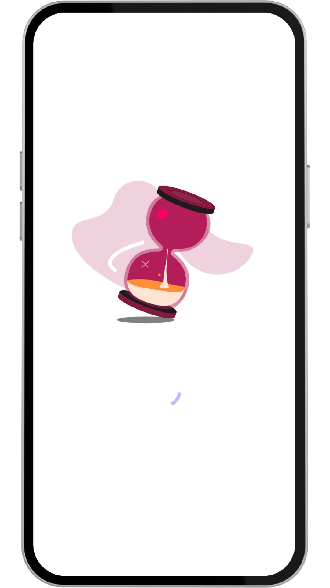
  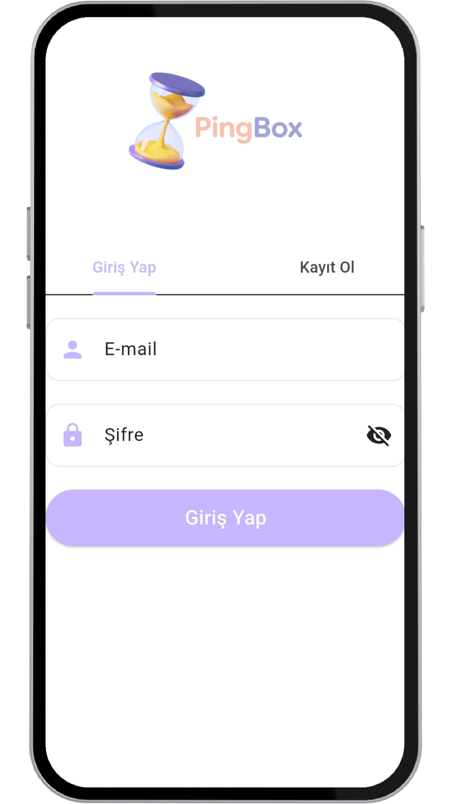
  

  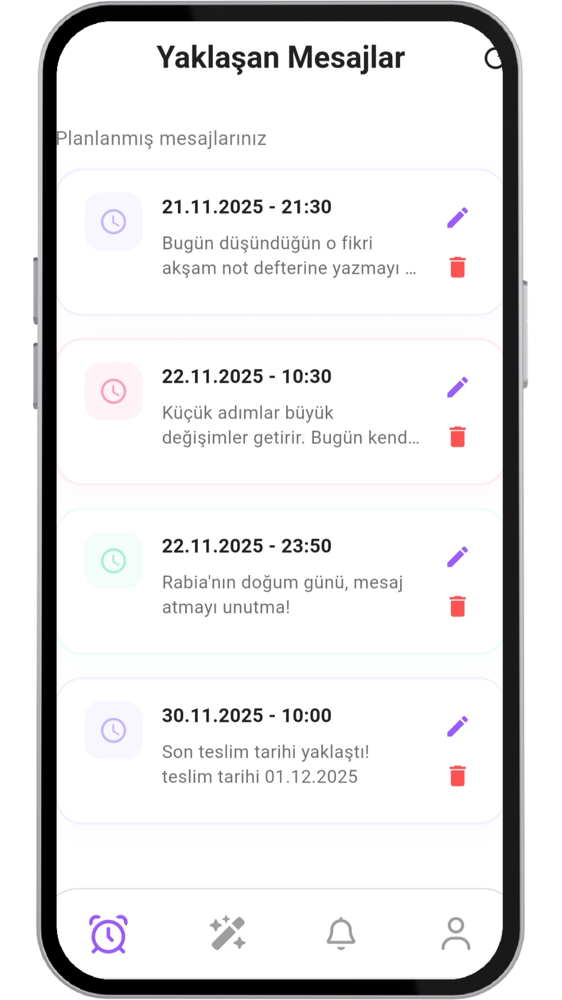
  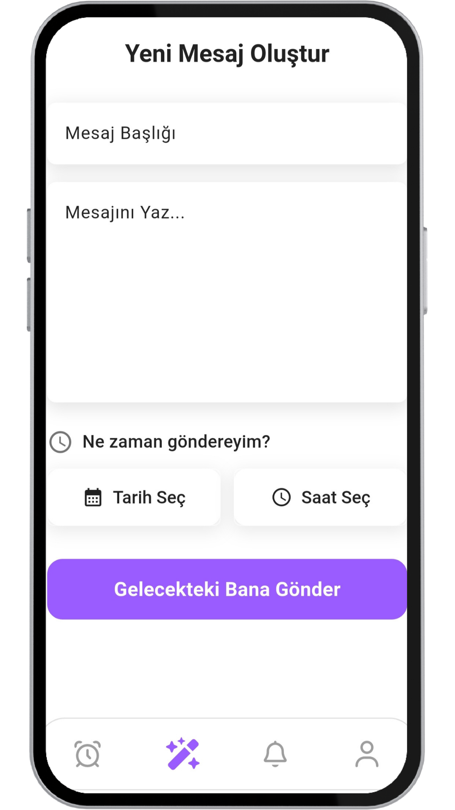
  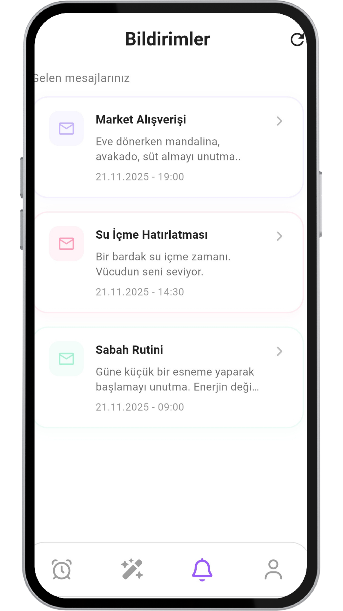

   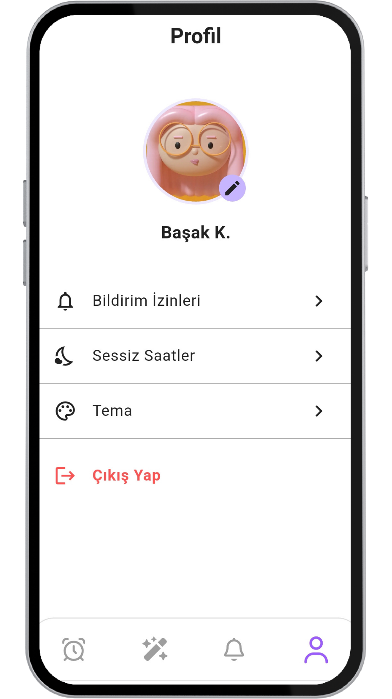
   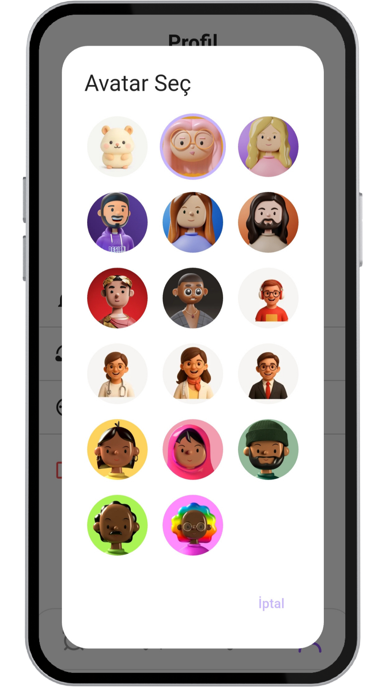
   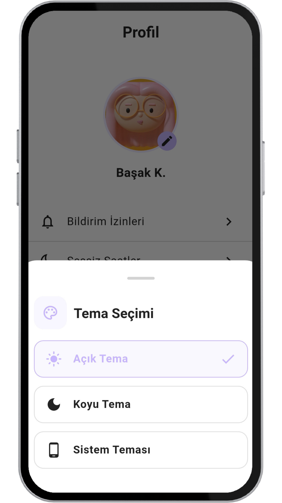

  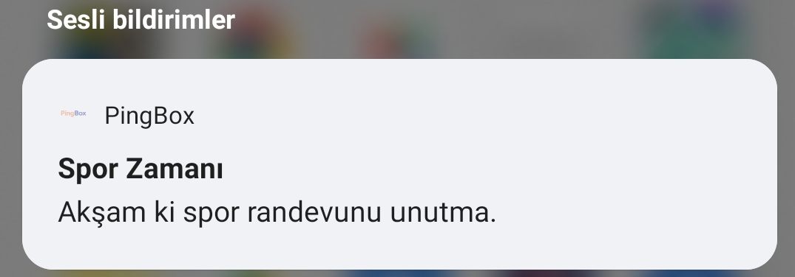

   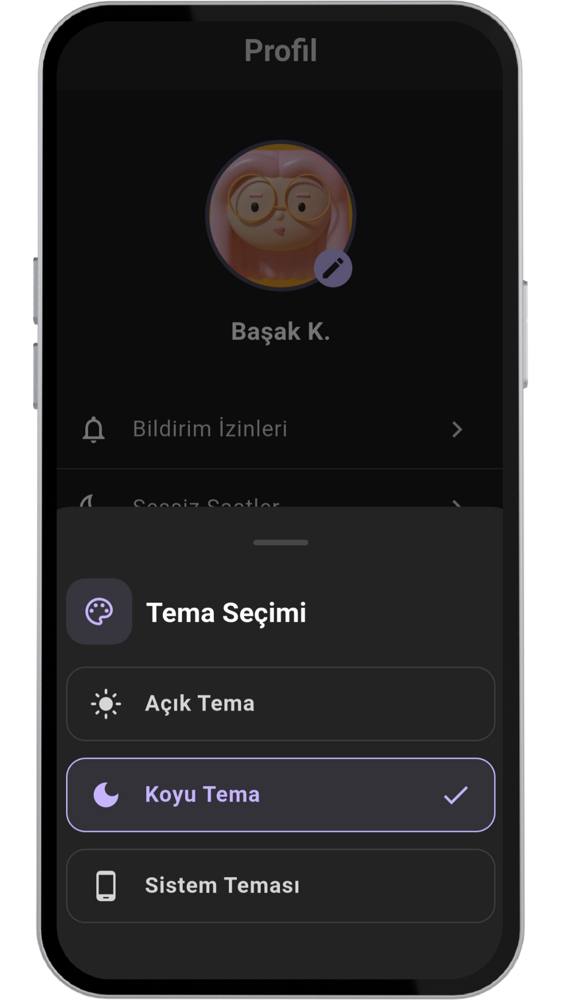
   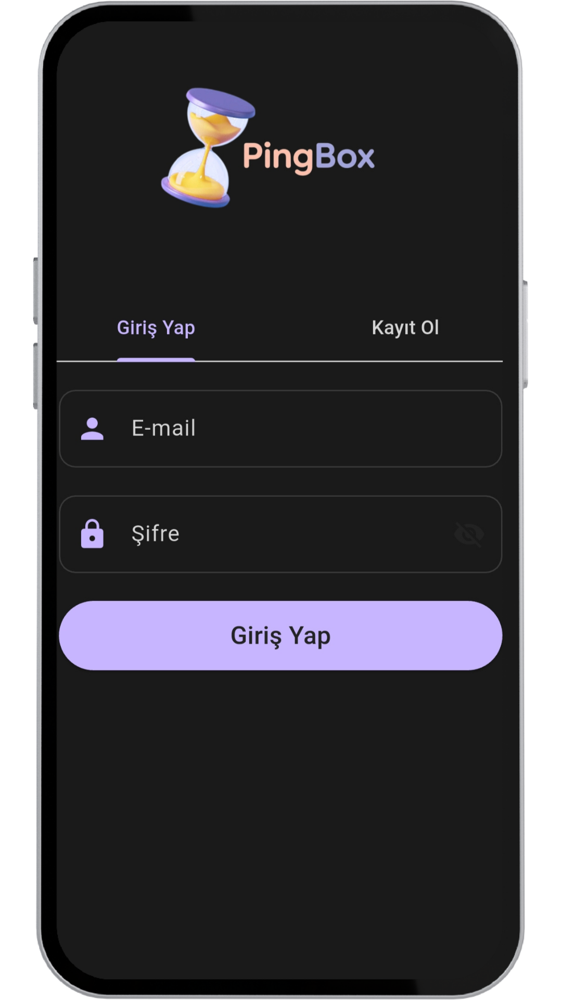
   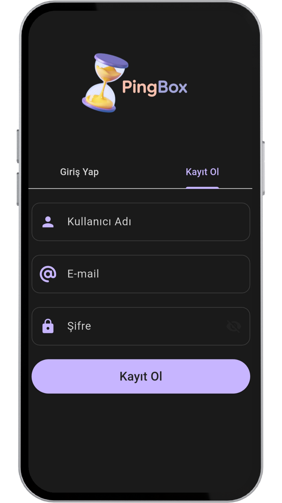
   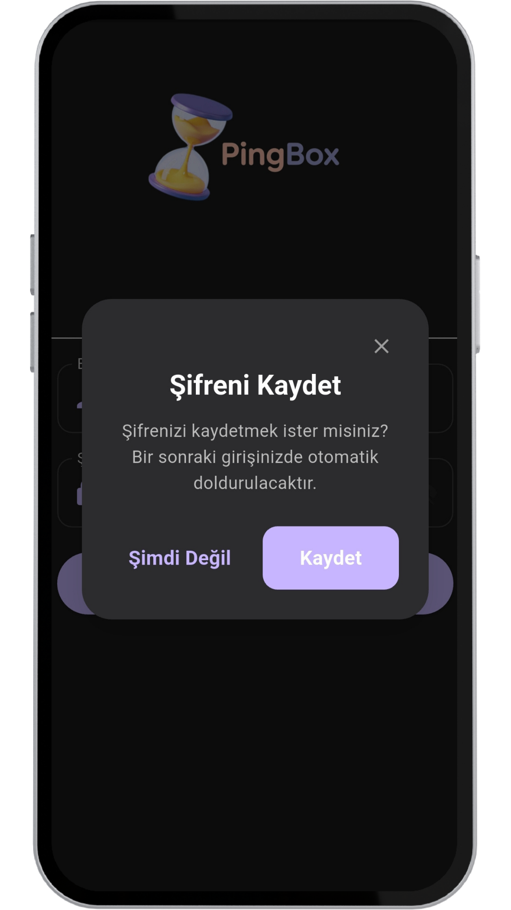

   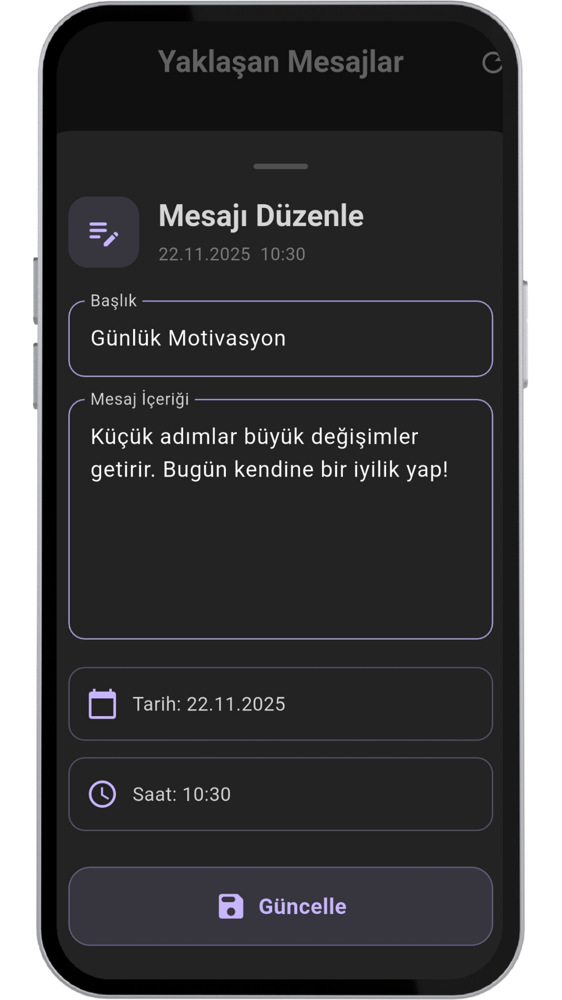
   
   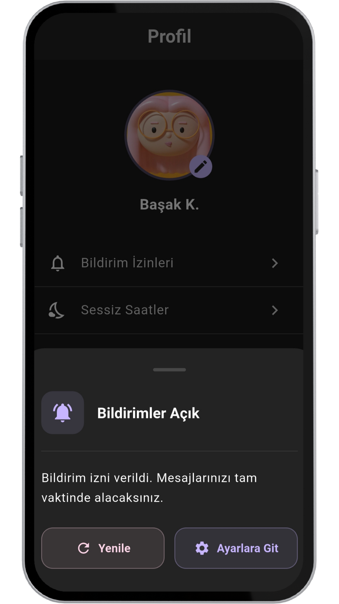
   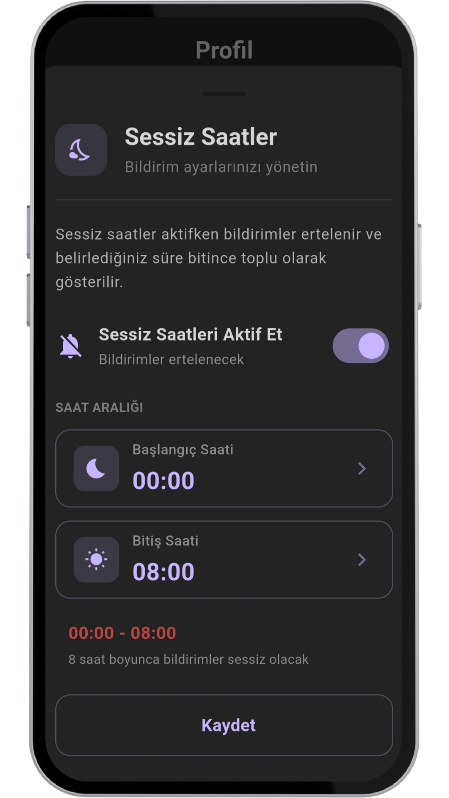

