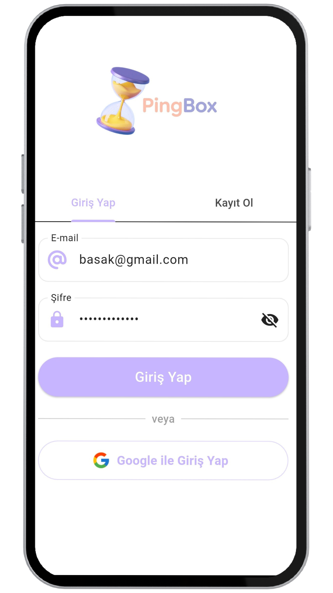
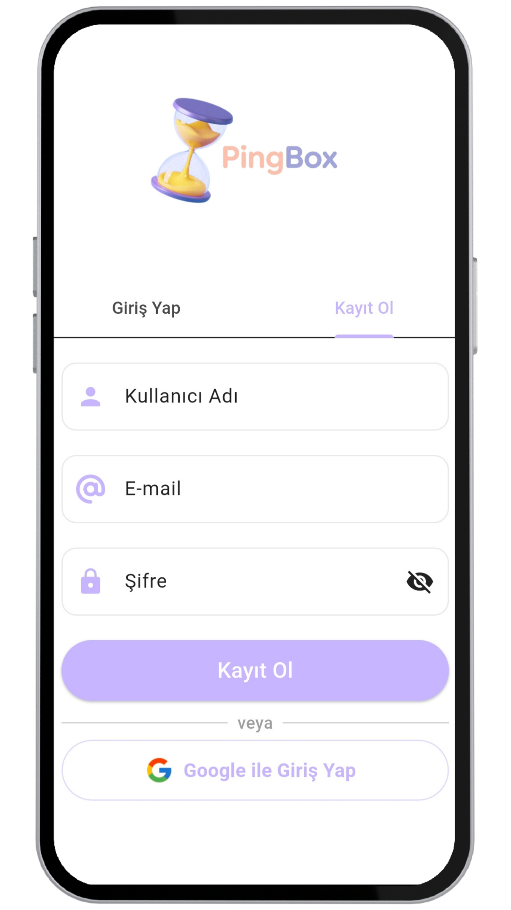
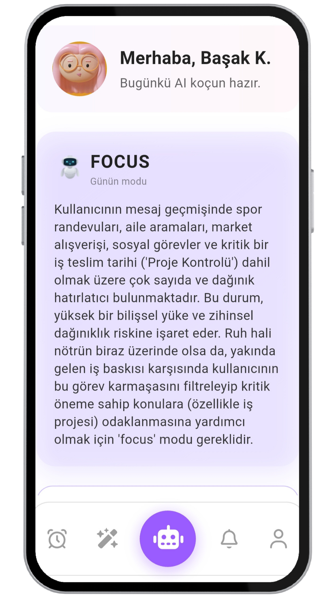
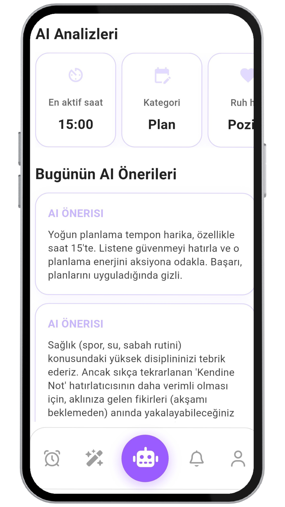
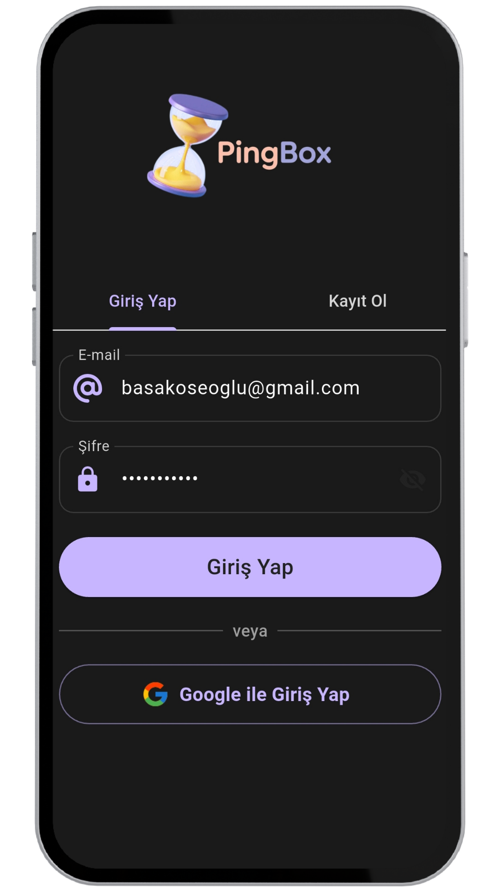
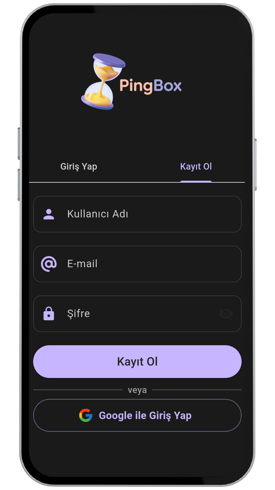
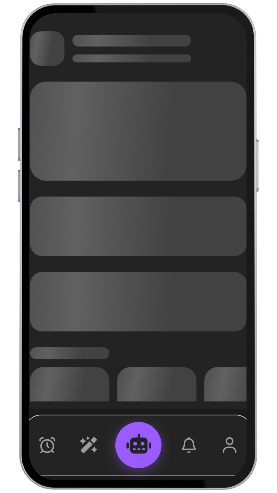
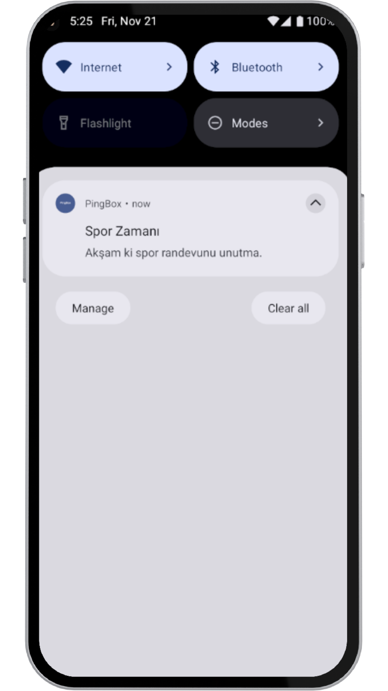

<h1 align="center">⏳⏱️ PingBox – Akıllı Mesajlama, Bildirim & Kişisel Asistan</h1>

  <b>PingBox</b>,kullanıcıların ileri tarihe <b> mesaj planlayabildiği </b>, <b> bildirim alabileceği </b>,<b> sessiz saatler tanımlayabileceği </b> kullanıcı davranışı analizi ve <b> AI destekli öneri sistemi </b> sunan modern bir kişisel iletişim asistanıdır.. 
  Flutter ile geliştirilmiş olup Firebase altyapısı kullanır. Gerçek zamanlı mesaj senkronizasyonu ve otomatik gönderim sistemiyle tamamen kullanıcı dostu bir deneyim sunar.

---
<h2>✨ Öne Çıkan Özellikler</h2>

## 🧠 AI Destekli Kişisel Asistan
PingBox, kullanıcı davranışlarını analiz ederek tamamen kişiye özel bir koçluk deneyimi sunar.

### ⚡ AI Modları
Sistem günlük olarak bir koç modu belirler:
- Focus – Odaklanmanı artırır
- Relax – Sakinleştirir
- Energy Boost – Enerjiyi yükseltir
- Mood Support – Duygusal denge önerileri
- Health – Sağlık odaklı tavsiyeler
Uygulamanın renk paleti günlük moda göre dinamik olarak güncellenir.

### 📊 AI Analiz Kartları
Kullanıcı davranışlarından çıkan sonuçlar:
- En aktif olduğun saat
- En sık kullandığın kategori
- Günlük ruh hali tahmini
Analizler modern kart tasarımı ile sunulur.

### 📩 AI Hatırlatmaları
PingBox, gün içinde sana özel hatırlatmalar üretir:
- Günün koç mesajı
- Planlı AI hatırlatması

###💡 AI Öneri Sistemi
Kullanım alışkanlıklarına göre otomatik öneriler sunar:
- “Bugün uzun süre aktiftin, biraz mola iyi gelebilir.”
- “Plan yoğun görünüyor. Küçük bir nefes egzersizi deneyebilirsin.”
- “Düşük ruh hali tespit edildi, minik bir yürüyüş ekleyebilirsin.”

### 📨 Mesaj Zamanlama
- Kullanıcı mesaj oluşturur ve istediği tarih/saat için planlar.
- Mesajlar zamanı geldiğinde otomatik olarak push bildirim olarak gönderilir.
- Mesaj düzenleme, silme ve yeniden planlama desteklenir.

### 🔔 Bildirim Sistemi 
- PingBox bildirim altyapısı tamamen Firebase FCM üzerinden çalışır.
- Anlık push bildirim gönderimi
- Kullanıcının Firestore’da saklanan FCM token’ı üzerinden iletilir
- Railway + Node.js servis, zamanlanmış mesajları saniyesi geldiğinde kontrol eder
- Sessiz saat içinde olan mesajlar engellenir

### 😴 Sessiz Saatler (Quiet Hours) 
- Kullanıcı kendine özel sessiz saat aralığı belirler.
- Bu saatlerde uygulama bildirim göndermez.
- “Başlangıç” ve “Bitiş” saatleri Firestore’da saklanır.
- Provider üzerinden UI anlık güncellenir.

### 👤 Kullanıcı Profili 
- Firebase Auth ile e-posta tabanlı kayıt ve giriş
- Profil avatarı (varsayılan + seçilebilir)
- Kullanıcıya özel FCM token saklama
- Sessiz saat bilgilerinin kullanıcıya bağlı olması

### 🔐 Google ile Giriş
PingBox hızlı giriş için Google Sign-In desteği sunar.
- Tek tıkla Google hesabıyla giriş
- Firebase Auth ile tam entegrasyon
- Profil verileri otomatik alınır
- Kullanıcı Firestore’a otomatik kaydedilir
- Profil fotoğrafı Google’dan çekilir
- FCM token otomatik saklanır
Bu sayede kullanıcı kayıt süreci hızlı ve zahmetsizdir.

### 🗂 Gerçek Zamanlı Veri Yönetimi 
- Firestore ile tüm veriler anlık senkronize edilir
- StreamBuilder ile anlık mesaj listesi
- delivered flag’i ile gönderilmiş mesajlar işaretlenir

### 🌗 Açık / Karanlık Tema Desteği
- Hem açık hem koyu tema desteği sunar.
- Tema tercihi uygulama ayarlarından seçilebilir.
- Tema durumu cihaz yeniden başlasa bile kaydedilir.
- Kullanıcı “Sistem Teması” modunu seçtiğinde cihazın tema modunu otomatik takip eder.
  
---
<h2>🎯 Uygulamanın Amacı</h2>

PingBox, kullanıcıların:
- Hayatını planlamasını
- Bildirimleri kişiselleştirmesini
- Rahatsız edilmek istemediği anları yönetmesini
- AI ile optimize edilmiş bir gün geçirmesini
- Kendi davranışlarını daha iyi anlamasını
sağlayan kişisel bir bildirim asistanıdır.

---

<h2>🧩 Kullanılan Teknolojiler</h2>

- Flutter 
- Firebase Auth
- Firebase Firestore  
- Firebase Cloud Messaging (FCM)
- Railway + Node.js (Zamanlanmış mesajları kontrol eden cron worker)
- Provider
---

<h2>📸 Ekran Görüntüleri</h2>

  
  
  
  

   
  
  

  
  
  

  
  
  

  

   
   
   

   
   
   

   
    
  
  

